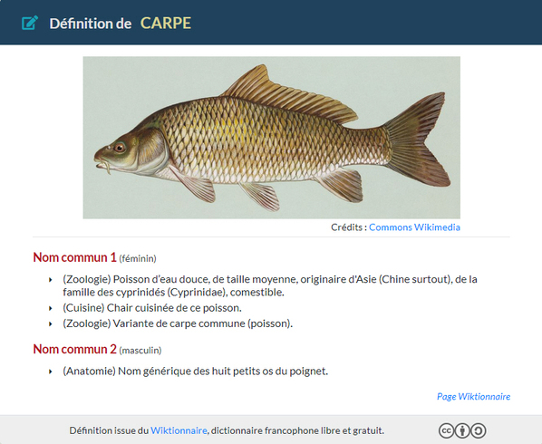
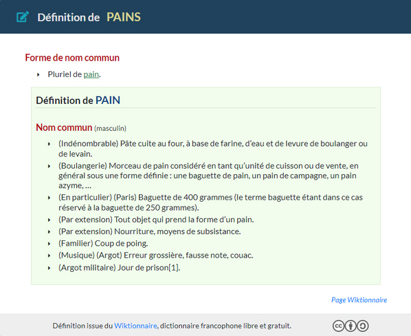

# API Dictionnaire Wiktionnaire


API qui permet d'obtenir, via le [Wiktionnaire](https://fr.wiktionary.org), la définition des termes passés en input.


  

## *** Demo ***

Page de test [ici](https://api-definition.fgainza.fr)  


## *** Features ***

Les éléments extraits sont :

* l'url de la page web
* l'url de l'image
* la légende de l'image
* l'url du crédit de l'image

* classe(s) grammaticale(s) du terme recherché
* le genre (pour les noms et pour les adjectifs)
* les définitions associées (sans aucun exemple)

* message d'erreur si le parsing a échoué

```javascript
{
  "motWiki": "carpe",
  "error": "",
  "direct_link": "https://fr.wiktionary.org/wiki/carpe",
  "url_img": "https://upload.wikimedia.org/wikipedia/commons/a/a8/Common_carp.jpg",
  "legende_img": "",
  "url_credits": "https://commons.wikimedia.org/wiki/File:Common_carp.jpg?uselang=fr",
  "nature": [
    "Nom commun 1",
    "Nom commun 2"
  ],
  "genre": [
    [
      "Nom commun 1",
      "féminin"
    ],
    [
      "Nom commun 2",
      "masculin"
    ]
  ],
  "natureDef": [
    [
      {
        "1": "(Zoologie) Poisson d’eau douce, de taille moyenne, originaire d'Asie (Chine surtout), de la famille des cyprinidés (Cyprinidae), comestible. ",
        "2": "(Cuisine) Chair cuisinée de ce poisson.",
        "3": "(Zoologie) Variante de carpe commune (poisson). "
      }
    ],
    [
      {
        "1": "(Anatomie) Nom générique des huit petits os du poignet. "
      }
    ]
  ]
}
```  


## *** Suppléments ***

2 cas particuliers pour lesquels des liens internes ont été ajoutés :

* les mots pluriels (lien vers la définition du mot au singulier)
* les verbes conjugués (lien vers la définition du verbe à l'infinitif)

Cela permet d'éviter d'avoir pour seule définition "Pluriel de ..." ou "3eme personne du singulier du verbe ..."


  


## *** Langages et bibliothèques utilisés ***

* Bootstrap
* PHP avec bibliothèque "simple_html_dom"
* Ajax JQuery   


## *** Auteur ***

* **Frédéric Gainza** _alias_ [@FredGainza](https://github.com/FredGainza)  


## *** License ***

Licence ``GNU General Public License v3.0`` - voir [LICENSE](LICENSE) pour plus d'informations
